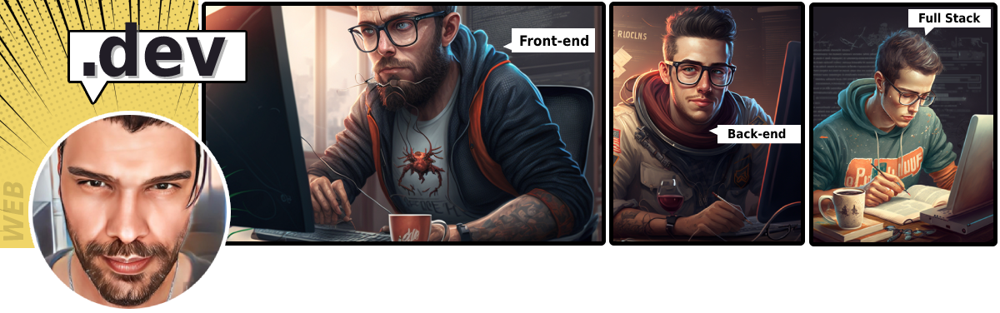

    

    <h2 style="position:relative;top:-13px;font-size:31px">Carlos Garcia</h2>   

## :rocket: Programador Web e Front-end especialista

__Localizado atualmente em Zona Oeste, São Paulo - SP__.

| Onde me encontrar | info |
|-----------------  |------|
| :link: [Linkedin](https://www.linkedin.com/in/carlos-cz) | linkedin.com/in/carlos-cz
| :link: [Github](https://github.com/chen-zhenn)           | github.com/chen-zhenn
| :phone: Celular | (11) 97038-9550

## :coffee: Sobre   

Desde 2008 tenho contato com desenvolvimento Web. Mas em 2010 foi quando comecei lidar com interfaces Web. Onde vivenciei toda evolução do desenvolvimento Web e maturidade pela que a mesma passou. Codando Front-end's com hacks HTML, CSS, JavaScript e AS3(saudoso Flash) - tempos longínquos...

Tenho maior profundidade e proficiência na linguagem JavaScript bem como todo seu ecossistema, incluindo frameworks reativos como React, Vue.js para Front-end e Node.Js - Back-end.

E dado experiência e atuação em projetos de aplicações com design e arquitetura mais madura, pude ter uma compreensão hands-on(mão na massa) do desenvolvimento ponta-a-ponta - full cycle, envolvendo arquitetura limpa(Clean Architecture), cobertura de testes(unitário, integração e end-to-end ) e deploys automatizados - CI/CD.

Em suma, há 12 anos lidando com a Web, com DNA Front-end e aquele apreço pelo ecossistema client-side.

__Competências__: Linux · Git · Desenvolvimento ágil · Desenvolvimento Web · Web Responsive · CSS · Frameworks CSS · Pré-processadores CSS · TypeScript · Frameworks reativos JS(React e Vue.js) · Usabilidade

__Interesses atuais__: Design Patterns, Clean Architecture, Node.js e Python.  

## :mortar_board: Formação

* Web Developer - [Impacta Tecnologia](https://impacta.com.br) - 2010
* Bacharelado em Produção multimedia(Comunicação pra Web) - [UNIP](https://www.unip.br) - 2009 a 2010
* Web Design - [Senai](https://www.sp.senai.br) - 2008

### :muscle: Experiências

* __Visie - Programador Pleno__
    Nov. de 2019 - Out de 2022 - 3 anos
    > Atuando como programador fullstack lidando com tecnologias e linguagens direcionadas para desenvolvimento web. E atuando em frentes/unidades como: Sistemas, Sites e Outsourcing.

    __:fire: Projeto(s) relevante__:

    __Portal B2B Yandeh__: Sistema B2B que cria a inteligência entre as operações varejista e fornecedor e integrações ligados ao ERP.    
    
    __Atividade__: Atuando primariamente como Front-end, porém colaborando/contribuindo com Back-end em algumas features.   
    
    __Linguagens__: Python e JavaScript.   
    
    __Tecnologias__: Vue(Nuxtjs), React(Next.js), Web2Py e FastAPI   
    
    __Database__: Postgres   
    
    __Front-end__   
    - Arquitetura
    - Layout portal e admin
    - Integração client-server e serviços   
 
    __Backend__   
    - Criação de endpoints e rotas
    - Estrutura de serviços   
